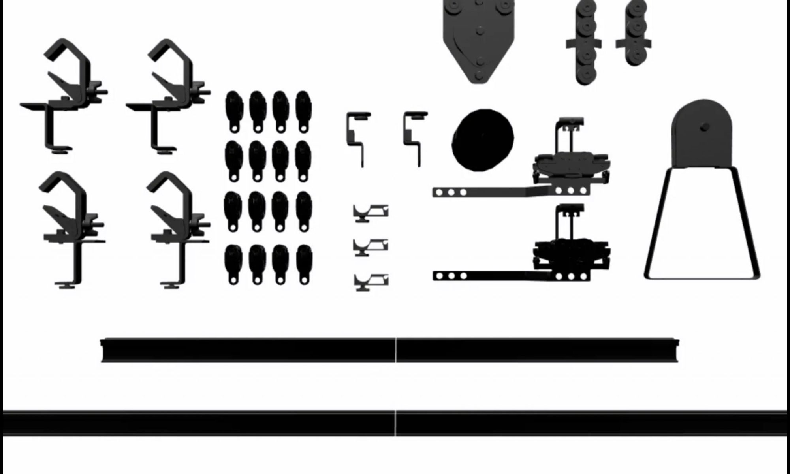

# Teilprojekt 4 - Prototypische Aufbauanleitung "Vorhangschiene TRUMPF 95"

---
**Inhaltsverzeichnis**
1. [Über das Projekt](#Über-das-Projekt)
2. [Projektaufbau](#Projektaufbau)
    1. [Installation & Entwicklung](#Installation-&-Entwicklung)
    2. [Entry Points](#Entry-Points)
    3. [Aufbauschritte](#Aufbauschritte)
    4. [Vorhangschiene 3D Model](#Vorhangschiene-3D-Model)
3. [Projektbeteiligte](#Projektbeteiligte)
4. [Lizenzen](#Lizenzen)
---

## 1. Über das Projekt
Die interaktiven Aufbauanleitung führt die Nutzer:innen nach einer Übersicht aller verwendeten Teile und benötigten Werkzeuge in zehn einfachen Schritten durch den Aufbau. Ein kurzer begleitender Text (theoretisch auch in mehreren Sprachen möglich) beschreibt die Vorgänge und weist auf Fallstricke hin, verrät Tipps und Tricks. Die einzelnen Aufbauschritte sind als dreidimensionale Animationen hinterlegt und können durch die Nutzer:innen nacheinander aufgerufen werden, dabei können Blickwinkel und Zoomfaktor selbst bestimmt werden. 

Die Aufbauanleitung kann in jedem WebXR-fähigen Browser erlebt werden. Dadurch ist es möglich sie sowohl in einer Virtual Reality- wie auch einer Augmented Reality Brille anzusehen.

Weitere Infos zum Projekt finden Sie [hier](https://digital.dthg.de/webxr-tutorial-ein-prototyp-fuer-digitale-aufbauanleitungen/).

Eine Demo finden Sie [hier](https://developer.digital.dthg.de/TP4/index.html)

---

## 2. Projektaufbau
Das Projekt wurde mit [Vue 2](https://vuejs.org/) entwickelt und nutzt [three.js](https://threejs.org/) als WebGL Framework sowie das npm-package [three-mesh-ui](https://www.npmjs.com/package/three-mesh-ui) für die Darstellung von Text im 3D Raum.

## Content
---
**Text & Settings der Aufbauschritte**

`src > Content > StaticContent.js`

---

**3D Model (.blend)**

`src > model > vorhangschiene.blend`

**3D Model (.gltf)**

`src > model > vorhangschiene_with_bones_and_animation.gltf`

--- 
#### **Icons (.svg)**
`src > js > Icons > *.svg`
 
***
***

## Installation & Entwicklung

Klonen oder downloaden Sie das Projekt auf Ihren Rechner und installieren Sie die Dependencies mit den nachstehenden Befehlen.

**Installation** `npm install`

**Development** `npm run serve`

**Build** `npm run build`

---

### Entry Points

**2D Frontend** `src > main.js`

**3D Scene** `src > ThreeD > MainScene.js`

---

## 3. Projektbeteiligte
### Gerriets GmbH
- Andreas Gause (Leiter Marketing & Business Development)

### digital.DTHG-Team: 
- Franziska Ritter, Pablo Dornhege (Projektleitung)
- Sascha Sigl, Lea Schorling (Entwicklung)
- Maria Bürger (UX Design)
- Vincent Kaufmann (fachliche Beratung)

---

## 4. Lizenzen
Environment HDRI: [Sergej Majboroda, License: CC0 (public domain](https://polyhaven.com/a/studio_small_08)
